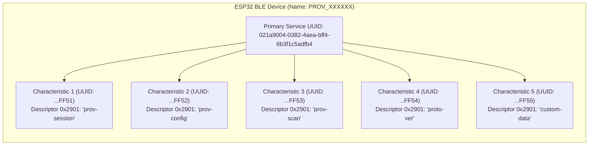
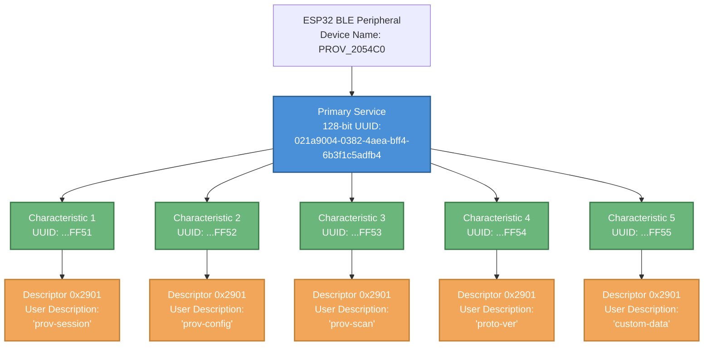
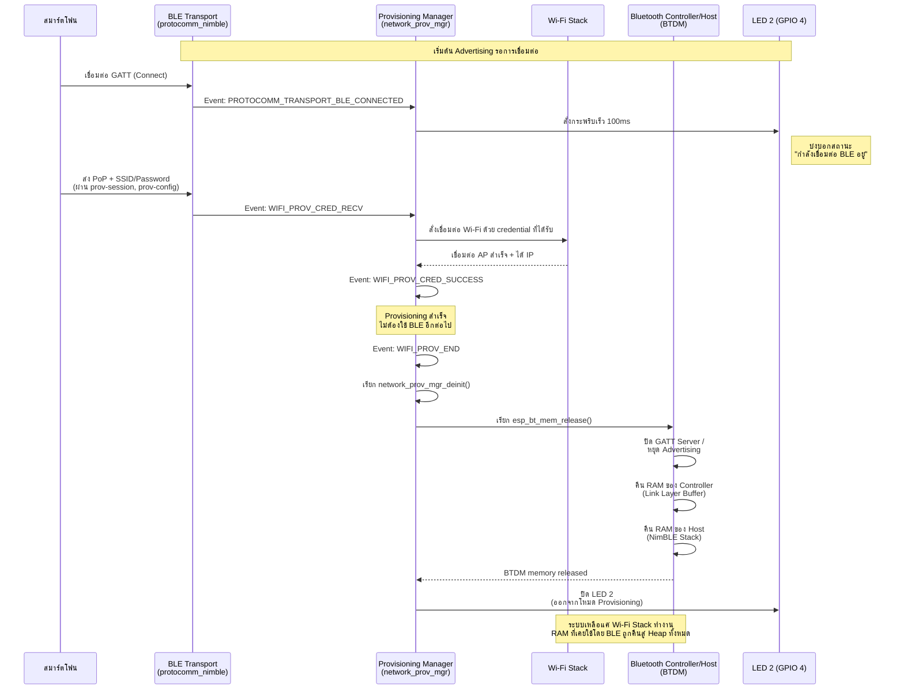

# ใบงานที่ 7.3 การคอนฟิก Wi-Fi ผ่าน BLE Scheme และการสืบสวน GATT Services (BLE Forensics)

## 0. กล่าวนำ (Introduction)
**Bluetooth Low Energy (BLE) Provisioning** เป็นรูปแบบมาตรฐานสากลที่อุปกรณ์ Smart Home ชั้นนำ (เช่น Apple HomeKit, Google Home, Matter Protocol) เลือกใช้ เนื่องจากผู้ใช้ไม่ต้องสลับการเชื่อมต่อ Wi-Fi บนสมาร์ตโฟน 

ในใบงานนี้ นักศึกษาจะได้สลับ ESP32 มาทำงานในโหมด **BLE Scheme (`wifi_prov_scheme_ble`)** พร้อมทั้งใช้เครื่องมือวิเคราะห์เชิงลึก **nRF Connect for Mobile** เพื่อส่องดูโครงสร้างภายในของ **GATT Primary Services, 128-bit UUIDs, Characteristics และ Descriptors** ก่อนจะทำการ Provisioning ผ่านแอป **ESP BLE Provisioning**

---

## 1. วัตถุประสงค์ (Objectives)
1. สามารถคอนฟิกตัวอย่าง `wifi_prov_mgr` ให้ทำงานในโหมด **BLE Transport Scheme** ได้สำเร็จ
2. สามารถใช้เครื่องมือ **nRF Connect for Mobile** ในการสแกนและตรวจสอบโครงสร้าง GATT Services/Characteristics ของ Protocomm บน ESP32
3. อ่านและวิเคราะห์ Descriptor `0x2901` (User Characteristic Description) เพื่อระบุชื่อ Protocomm Endpoints
4. ดำเนินการ Provisioning ผ่านแอปพลิเคชัน **ESP BLE Provisioning** และสังเกตการคืนหน่วยความจำ Bluetooth RAM (`BTDM memory released`)

---

## 2. อุปกรณ์และซอฟต์แวร์ที่ใช้ในการทดลอง
1. บอร์ดไมโครคอนโทรลเลอร์ ESP32 พร้อมสาย USB
2. สมาร์ตโฟนที่รองรับ BLE และติดตั้งแอปพลิเคชัน:
   - **nRF Connect for Mobile** (โดย Nordic Semiconductor)
   - **ESP BLE Provisioning** (โดย Espressif)
3. Wi-Fi Access Point ภายในห้องเรียนหรือ Hotspot

---

## 3. สถาปัตยกรรม GATT Services & Endpoints บน BLE Scheme



---

## 4. ขั้นตอนการทดลอง (Step-by-Step Procedures)

### ขั้นตอนที่ 1: การเปิดโปรเจกต์ Lab 7-3
1. เปิด Terminal ในโฟลเดอร์โปรเจกต์ `Week-07-W-iFi-Privisioning/Example_codes/Lab7-3-BLE-Provisioning`
2. โค้ดในโปรเจกต์นี้ได้รับการตั้งค่าเปิดใช้งาน **BLE Scheme (NimBLE)** และ **Security 1 (PoP: `abcd1234`)** ไว้เรียบร้อยแล้ว

---

### ขั้นตอนที่ 2: Build, Flash และตรวจสอบสถานะเริ่มต้น
1. สั่งล้าง Flash และ Flash โปรแกรมใหม่:
   ```powershell
   idf.py -p COM24 erase-flash flash monitor
   ```
2. สังเกต Log ใน Serial Monitor:
   ```text
   I (712) wifi_prov_scheme_ble: Starting BLE provisioning
   I (722) app: Starting provisioning
   I (732) app: Scan this QR code from the provisioning application for Provisioning.
   ... [QR Code ASCII & URL] ...
   ```

---

### ขั้นตอนที่ 3: ส่องโครงสร้าง GATT ผ่านแอป nRF Connect (BLE Forensic)
1. เปิดแอป **nRF Connect for Mobile** บนสมาร์ตโฟน
2. แตะปุ่ม **Scan** เพื่อค้นหาอุปกรณ์บลูทูธรอบตัว
3. ค้นหาชื่ออุปกรณ์ที่ขึ้นต้นด้วย `PROV_XXXXXX` (ตรงกับที่ระบุใน Serial Monitor)
4. สังเกตค่า RSSI และแตะปุ่ม **CONNECT** เพื่อเชื่อมต่อ
5. เมื่อเชื่อมต่อสำเร็จ สำรวจดู **GATT Services**:
   - มองหา **Unknown Service** ที่มี Base UUID `021a9004-0382-4aea-bff4-6b3f1c5adfb4`
   - ขยายดูรายการ Characteristics แต่ละตัว
   - สังเกตว่าในแต่ละ Characteristic จะมี Descriptor `Characteristic User Description` (`UUID 0x2901`) แตะดูค่า จะพบชื่อ Endpoint เช่น `"prov-session"`, `"prov-config"`, `"custom-data"`
6. บันทึกภาพหน้าจอและข้อมูล UUIDs ลงในตารางผลการทดลอง
7. กดปุ่ม **DISCONNECT** บนแอป nRF Connect เพื่อปล่อยบอร์ดให้พร้อมรับการ Provision

---

### ขั้นตอนที่ 4: ทำการ Provisioning ด้วยแอป ESP BLE Provisioning
1. เปิดแอป **ESP BLE Provisioning**
2. เลือก "Provision New Device" $\rightarrow$ เลือก "BLE"
3. แตะชื่อบอร์ด `PROV_XXXXXX` (หรือสแกน QR Code)
4. ป้อน PoP เป็น `abcd1234`
5. เลือกเครือข่าย Wi-Fi ในห้องเรียน และป้อนรหัสผ่าน Wi-Fi
6. กด **Provision** และรอจนกระทั่งเชื่อมต่อสำเร็จ

---

### ขั้นตอนที่ 5: สังเกตการปล่อยหน่วยความจำ Bluetooth (Memory Freeing)
สังเกตใน Serial Monitor หลังเชื่อมต่อ Wi-Fi สำเร็จ:
```text
I (24560) app: Provisioning successful
I (24570) wifi_prov_scheme_ble: BT memory released
I (24580) wifi_prov_scheme_ble: BTDM memory released
I (26120) app: Connected with IP Address: 192.168.1.155
```
> **ข้อสังเกต:** บอร์ดจะทำการล้างและคืนหน่วยความจำของ Bluetooth Stack ทั้งหมดคืนสู่ระบบ DRAM ทันที ทำให้ประหยัด RAM ได้มหาศาล!

---
## Log การทำงานจริงที่บันทึก การปล่อยหน่วยความจำ Bluetooth (Memory Freeing)
```text
I (27) boot: ESP-IDF v6.0.2 2nd stage bootloader
I (27) boot: compile time Sep  8 2026 09:27:37
I (28) boot: Multicore bootloader
I (29) boot: chip revision: v3.1
I (32) boot.esp32: SPI Speed      : 40MHz
I (35) boot.esp32: SPI Mode       : DIO
I (39) boot.esp32: SPI Flash Size : 2MB
I (42) boot: Enabling RNG early entropy source...
I (47) boot: Partition Table:
I (49) boot: ## Label            Usage          Type ST Offset   Length
I (56) boot:  0 nvs              WiFi data        01 02 00009000 00006000
I (62) boot:  1 phy_init         RF data          01 01 0000f000 00001000
I (69) boot:  2 factory          factory app      00 00 00010000 00150000
I (75) boot: End of partition table
I (79) esp_image: segment 0: paddr=00010020 vaddr=3f400020 size=2a640h (173632) map
I (148) esp_image: segment 1: paddr=0003a668 vaddr=3ffbdb60 size=059b0h ( 22960) load
I (157) esp_image: segment 2: paddr=00040020 vaddr=400d0020 size=c2568h (796008) map
I (441) esp_image: segment 3: paddr=00102590 vaddr=3ffc3510 size=0096ch (  2412) load
I (442) esp_image: segment 4: paddr=00102f04 vaddr=40080000 size=1f880h (129152) load
I (498) esp_image: segment 5: paddr=0012278c vaddr=50000000 size=00028h (    40) load
I (514) boot: Loaded app from partition at offset 0x10000
I (514) boot: Disabling RNG early entropy source...
I (525) cpu_start: Multicore app
I (533) cpu_start: GPIO 3 and 1 are used as console UART I/O pins
I (533) cpu_start: Pro cpu start user code
I (533) cpu_start: cpu freq: 160000000 Hz
I (535) app_init: Application information:
I (539) app_init: Project name:     lab7_3_ble_provisioning
I (544) app_init: App version:      7b74128-dirty
I (548) app_init: Compile time:     Sep  8 2026 09:27:18
I (553) app_init: ELF file SHA256:  aee53c00f...
I (558) app_init: ESP-IDF:          v6.0.2
I (562) efuse_init: Min chip rev:     v0.0
I (565) efuse_init: Max chip rev:     v3.99 
I (569) efuse_init: Chip rev:         v3.1
I (574) heap_init: Initializing. RAM available for dynamic allocation:
I (580) heap_init: At 3FFAFF10 len 000000F0 (0 KiB): DRAM
I (585) heap_init: At 3FFB6388 len 00001C78 (7 KiB): DRAM
I (590) heap_init: At 3FFB9A20 len 00004108 (16 KiB): DRAM
I (595) heap_init: At 3FFC9238 len 00016DC8 (91 KiB): DRAM
I (600) heap_init: At 3FFE0440 len 00003AE0 (14 KiB): D/IRAM
I (606) heap_init: At 3FFE4350 len 0001BCB0 (111 KiB): D/IRAM
I (611) heap_init: At 4009F880 len 00000780 (1 KiB): IRAM
I (618) spi_flash: detected chip: generic
I (620) spi_flash: flash io: dio
W (623) spi_flash: Detected size(4096k) larger than the size in the binary image header(2048k). Using the size in the binary image header.
I (636) coexist: coex firmware version: 6f3d08c
I (640) main_task: Started on CPU0
I (640) main_task: Calling app_main()
I (680) wifi:wifi driver task: 3ffcd480, prio:23, stack:6656, core=0
I (680) wifi:wifi firmware version: 00ad238
I (680) wifi:wifi certification version: v7.0
I (680) wifi:config NVS flash: enabled
I (680) wifi:config nano formatting: disabled
I (690) wifi:Init data frame dynamic rx buffer num: 32
I (690) wifi:Init static rx mgmt buffer num: 5
I (700) wifi:Init management short buffer num: 32
I (700) wifi:Init dynamic tx buffer num: 32
I (700) wifi:Init static rx buffer size: 1600
I (710) wifi:Init static rx buffer num: 10
I (710) wifi:Init dynamic rx buffer num: 32
I (720) wifi_init: rx ba win: 6
I (720) wifi_init: accept mbox: 6
I (720) wifi_init: tcpip mbox: 32
I (720) wifi_init: udp mbox: 6
I (730) wifi_init: tcp mbox: 6
I (730) wifi_init: tcp tx win: 5760
I (730) wifi_init: tcp rx win: 5760
I (740) wifi_init: tcp mss: 1440
I (740) wifi_init: WiFi IRAM OP enabled
I (740) wifi_init: WiFi RX IRAM OP enabled
I (750) network_prov_scheme_ble: BT memory released
I (750) LAB7_3_BLE: Starting BLE Provisioning (Name: PROV_2054C0, PoP: abcd1234)
I (760) phy_init: phy_version 4863,a3a4459,Oct 28 2025,14:30:06
W (760) phy_init: failed to load RF calibration data (0x1102), falling back to full calibration
I (840) phy_init: Saving new calibration data due to checksum failure or outdated calibration data, mode(2)
I (850) wifi:mode : sta (84:1f:e8:20:54:c0)
I (850) wifi:enable tsf
W (860) BTDM_INIT: esp_bt_controller_rom_mem_release already released, mode 2
I (860) BTDM_INIT: BT controller compile version [e02a38e]
I (860) BTDM_INIT: Using main XTAL as clock source
I (870) BTDM_INIT: Bluetooth MAC: 84:1f:e8:20:54:c2
I (1110) protocomm_nimble: BLE Host Task Started
I (1120) network_prov_mgr: Provisioning started with service name : PROV_2054C0 
I (1130) LAB7_3_BLE: [PROV EVENT]: BLE Provisioning Started (Advertising)!
I (1130) LAB7_3_BLE: --------------------------------------------------
I (1140) LAB7_3_BLE: [QR CODE URL]: Click or copy the URL below:
I (1140) LAB7_3_BLE: https://espressif.github.io/esp-jumpstart/qrcode.html?data=%7B%22ver%22%3A%22v1%22%2C%22name%22%3A%22PROV_2054C0%22%2C%22pop%22%3A%22abcd1234%22%2C%22transport%22%3A%22ble%22%7D
I (1160) LAB7_3_BLE: Payload JSON: {"ver":"v1","name":"PROV_2054C0","pop":"abcd1234","transport":"ble"}
I (1170) NimBLE: GAP procedure initiated: advertise; 
I (1170) NimBLE: disc_mode=2
I (1170) NimBLE:  adv_channel_map=0 own_addr_type=0 adv_filter_policy=0 adv_itvl_min=256 adv_itvl_max=256
I (1180) NimBLE: 

I (1190) LAB7_3_BLE: --------------------------------------------------
I (1190) main_task: Returned from app_main()
I (25700) LAB7_3_BLE: [BLE]: Smartphone Connected to GATT Server!
I (25970) protocomm_nimble: mtu update event; conn_handle=0 cid=4 mtu=256
W (45590) LAB7_3_BLE: [BLE]: Smartphone Disconnected from GATT Server
W (45590) LAB7_3_BLE: [BLE]: Smartphone Disconnected from GATT Server
I (45590) NimBLE: GAP procedure initiated: advertise; 
I (45590) NimBLE: disc_mode=2
I (45600) NimBLE:  adv_channel_map=0 own_addr_type=0 adv_filter_policy=0 adv_itvl_min=256 adv_itvl_max=256
I (45600) NimBLE: 

I (63680) LAB7_3_BLE: [BLE]: Smartphone Connected to GATT Server!
I (63830) protocomm_nimble: mtu update event; conn_handle=0 cid=4 mtu=256
W (66560) LAB7_3_BLE: [BLE]: Smartphone Disconnected from GATT Server
W (66560) LAB7_3_BLE: [BLE]: Smartphone Disconnected from GATT Server
I (66560) NimBLE: GAP procedure initiated: advertise; 
I (66560) NimBLE: disc_mode=2
I (66570) NimBLE:  adv_channel_map=0 own_addr_type=0 adv_filter_policy=0 adv_itvl_min=256 adv_itvl_max=256
I (66570) NimBLE: 

I (66860) LAB7_3_BLE: [BLE]: Smartphone Connected to GATT Server!
I (67070) protocomm_nimble: mtu update event; conn_handle=0 cid=4 mtu=256
I (68060) security1: 30 8b 64 5e d3 64 68 06 6f 31 66 30 0c e1 23 d2
I (68060) security1: 33 bd 12 3f f2 73 79 4f 32 02 b5 87 d6 97 3b 2c
I (68070) security1: fa 12 98 c1 98 e6 e1 24 d7 ea 72 8f ca 12 47 b0
I (68070) security1: 9f e5 35 69 6b 48 6c cc 46 c7 f5 80 3d 57 4d 4c
I (68380) security1: fb 1e 21 e0 8b be d0 48 15 05 d8 12 ff 0c 5e 67
I (68380) security1: 0f b6 fb 95 59 05 9b c3 9b 29 65 11 b7 55 68 df
I (68380) security1: 2b 83 36 0c 49 ab b0 4f 32 fa 84 5c 90 64 d1 9d
I (68600) security1: f3 84 2b 08 ef 69 d8 20 7e 0c 03 9b f3 14 6c bb
I (68600) security1: ae 28 9f 30 a2 18 14 18 13 63 5f 82 7a 9c dc 27
I (68600) security1: 30 8b 64 5e d3 64 68 06 6f 31 66 30 0c e1 23 d2
I (68600) security1: 33 bd 12 3f f2 73 79 4f 32 02 b5 87 d6 97 3b 2c
I (68610) security1: de c4 8c 75 ed 4a ec 4a 34 33 67 68 31 77 9e 93
I (68620) security1: fc 07 b6 1f fc bf c4 f3 89 e6 c2 9c e2 53 c8 61
I (79700) LAB7_3_BLE: =================================================
I (79700) LAB7_3_BLE: [BLE CREDENTIALS RECEIVED]:
I (79700) LAB7_3_BLE:   -> SSID     : KMITL-WIFI
I (79700) LAB7_3_BLE:   -> Password : 
I (79710) LAB7_3_BLE: =================================================
I (85520) wifi:state: init -> auth (0xb0)
I (85550) wifi:state: auth -> assoc (0x0)
I (85590) wifi:state: assoc -> run (0x10)
I (85590) wifi:connected with KMITL-WIFI, aid = 6, channel 1, BW20, bssid = 78:17:be:c0:7d:a1
I (85590) wifi:security: Open Auth, phy: bgn, rssi: -44, cipher(pairwise:0x0, group:0x0), pmf:0
I (85610) wifi:pm start, type: 1

I (85630) wifi:<ba-add>idx:0 (ifx:0, 78:17:be:c0:7d:a1), tid:0, ssn:0, winSize:64
I (85740) wifi:AP's beacon interval = 204800 us, DTIM period = 1
I (87630) wifi:<ba-add>idx:1 (ifx:0, 78:17:be:c0:7d:a1), tid:6, ssn:0, winSize:64
I (88670) LAB7_3_BLE: =================================================
I (88670) LAB7_3_BLE: [ONLINE]: Connected to Wi-Fi with IP: 10.15.11.202
I (88670) LAB7_3_BLE: =================================================
I (88670) esp_netif_handlers: sta ip: 10.15.11.202, mask: 255.255.240.0, gw: 10.15.0.1
I (88680) network_prov_mgr: STA Got IP
I (88690) LAB7_3_BLE: [SUCCESS]: BLE Provisioning Successful!
```
---

## 5. กิจกรรมถอดรหัสซอร์สโค้ดและเขียนผังงาน (Code Deconstruction & BLE GATT Architecture Assignment)

ให้นักศึกษาแกะรอยการทำงานของโมดูล BLE Provisioning ใน `main/main.c` แล้วเขียน **ผังโครงสร้างและลำดับเหตุการณ์**:

### ภารกิจที่ 1: ผังโครงสร้าง GATT Tree & Endpoint Mapping
ให้นักศึกษาวาดโครงสร้างต้นไม้ (Tree Diagram / Block Diagram) แสดงความสัมพันธ์ระหว่าง:
- **Primary Service (128-bit UUID: `021a9004-...`)**
  - **Characteristic UUIDs** แต่ละตัว
  - **Descriptor 0x2901 (User Description)** ที่ผูกเข้ากับ Protocomm Endpoints (`prov-session`, `prov-config`, `prov-scan`, `proto-ver`, `custom-data`)




### ภารกิจที่ 2: ผังลำดับการคืนหน่วยความจำ Bluetooth (BLE Lifecycle & Memory Reclaim Flow)
ให้นักศึกษาวาด Flowchart / Sequence แสดงว่า:
1. การเชื่อมต่อ BLE ถูกตรวจพบผ่าน Event `PROTOCOMM_TRANSPORT_BLE_CONNECTED` (LED 2 กระพริบเร็ว 100ms)
2. เมื่อเชื่อมต่อ Wi-Fi สำเร็จ (`WIFI_PROV_CRED_SUCCESS`) $\rightarrow$ เกิด Event `WIFI_PROV_END`
3. Provisioning Manager สั่งเรียก `esp_bt_mem_release()` เพื่อปล่อย DRAM คืนสู่ระบบอย่างไร



---

## 6. ตารางบันทึกผลการทดลอง (Experiment Results)

| รายการตรวจสอบ | ผลการทดลอง / ข้อมูลที่สังเกตได้ |
| :--- | :--- |
| **1. BLE Device Name ที่สแกนเจอ** | `PROV_2054C0` |
| **2. Primary Service UUID (128-bit)** | `021a9004-0382-4aea-bff4-6b3f1c5adfb4` |
| **3. Characteristic Endpoint ที่พบ (0x2901)** | 1. `prov-session` — จัดการ Security1 Handshake<br/>2. `prov-config` — รับค่า SSID/Password<br/>3. `prov-scan` — สั่งสแกน Wi-Fi AP |
| **4. พฤติกรรมไฟ LED 2 (GPIO 4) ช่วงรอ vs ช่วงต่อ BLE** | ช่วงรอ (Advertising): LED 2 **ติดค้าง** (จาก Event `NETWORK_PROV_START`)<br/>ช่วงต่อ Wi-Fi สำเร็จ: LED 2 **ดับ** (จาก Event `NETWORK_PROV_WIFI_CRED_SUCCESS`) |
| **5. พฤติกรรมเมื่อต่อ Wi-Fi สำเร็จ** | มี Log คืนหน่วยความจำ Bluetooth หรือไม่? **มี** — พบ Log `[SUCCESS]: BLE Provisioning Successful!` และได้ IP `10.15.11.202` จาก SSID `KMITL-WIFI` สำเร็จ (Log ส่วน `BTDM memory released` ตัดหายช่วงท้ายเทอร์มินัล ควรเลื่อนดูยืนยันอีกครั้ง) |

---

## 7. คำถามท้ายการทดลอง (Post-Lab Questions)
1. เหตุใด BLE Provisioning จึงไม่ส่งผลให้สัญญาณ Wi-Fi บนสมาร์ตโฟนของผู้ใช้หลุดระหว่างทำรายการ?
- เพราะ BLE กับ Wi-Fi เป็นคนละ Radio/คนละช่องสัญญาณกันโดยสิ้นเชิง สมาร์ตโฟนใช้ BLE คุยกับ ESP32 เพื่อส่ง SSID/Password เท่านั้น ไม่ได้เปลี่ยนไปเชื่อมต่อ Wi-Fi ของ ESP32 เหมือนวิธี SoftAP แบบเก่า ดังนั้น Wi-Fi ของมือถือที่ต่ออินเทอร์เน็ตอยู่จึงไม่ต้องสลับเครือข่ายเลยตลอดกระบวนการ

2. Descriptor `0x2901` มีความสำคัญอย่างไรต่อการที่แอปพลิเคชันมือถือจะทราบว่า Characteristic แต่ละตัวใช้ทำหน้าที่อะไร?
- Characteristic แต่ละตัวมีแค่ UUID เป็นตัวเลข ไม่สื่อความหมายในตัวเอง Descriptor `0x2901` (User Characteristic Description) คือส่วนที่แนบ "ชื่อที่มนุษย์อ่านได้" เข้าไปกับ UUID นั้น เช่น `prov-config`, `prov-scan` ทำให้แอปพลิเคชัน (หรือคนใช้ nRF Connect) รู้ได้ทันทีว่า Characteristic ตัวไหนใช้ทำหน้าที่อะไร โดยไม่ต้อง hardcode UUID ไว้ล่วงหน้า


3. การที่ ESP-IDF มีฟังก์ชัน `esp_bt_mem_release()` มีประโยชน์อย่างไรต่อการทำงานของแอปพลิเคชัน IoT หลังเชื่อมต่อ Wi-Fi สำเร็จ?
- หลัง Provisioning เสร็จ ตัว BLE Stack จะไม่ถูกใช้งานอีกเลยตลอดอายุการทำงานของอุปกรณ์ การเรียก `esp_bt_mem_release()` จะคืน RAM ก้อนใหญ่ที่ BLE เคยจองไว้กลับสู่ระบบ ทำให้เหลือ Heap ว่างมากขึ้นสำหรับแอปพลิเคชัน IoT ไปใช้งานจริง เช่น เปิด TLS/HTTPS, เก็บ Buffer ข้อมูลเซนเซอร์ หรือรันงานอื่นที่ต้องการหน่วยความจำเยอะ ซึ่งสำคัญมากบนชิปที่มี RAM จำกัดอย่าง ESP32

