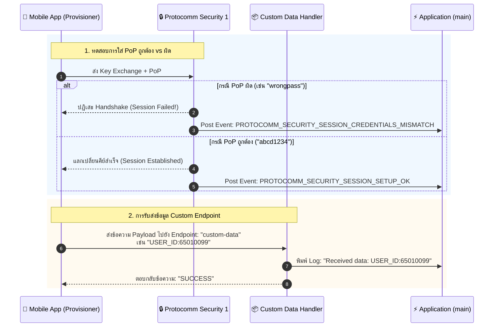
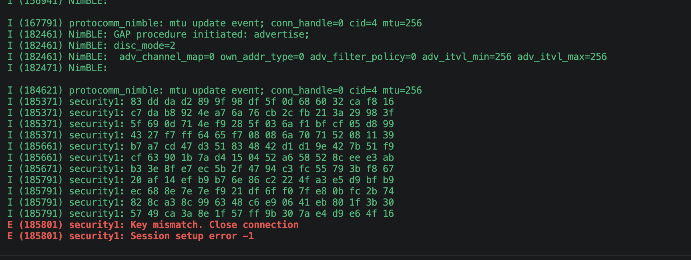
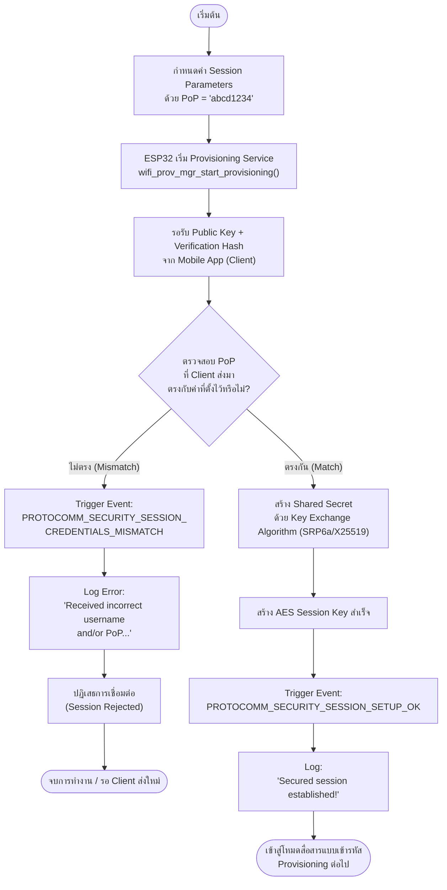
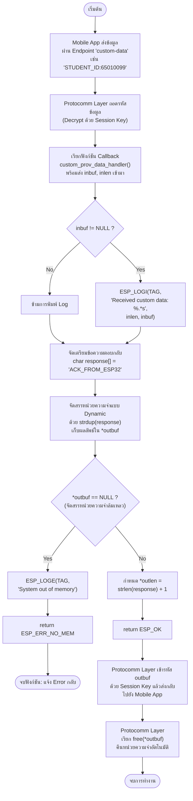

# ใบงานที่ 7.4: การทดสอบ Security Schemes (PoP) และการรับส่ง Custom Data Endpoints

## 0. กล่าวนำ (Introduction)
ในใบงานนี้ นักศึกษาจะได้ทดสอบเจาะลึกด้านความปลอดภัยของกระบวนการ Provisioning โดยทำการทดลองจำลองสถานการณ์ที่มีผู้ไม่หวังดีพยายามเชื่อมต่อด้วย **รหัส Proof-of-Possession (PoP) ที่ไม่ถูกต้อง** เพื่อสังเกตกลไกการปฏิเสธการเชื่อมต่อของ Protocomm Security Layer

นอกจากนี้ นักศึกษาจะได้เรียนรู้การเพิ่ม **Custom Data Endpoint (`custom-data`)** เพื่อรับส่งข้อมูลเฉพาะของแอปพลิเคชัน (เช่น Device ID, Owner Email, MQTT Broker URL หรือ Activation Code) ระหว่างมือถือและ ESP32 ในระหว่างขั้นตอน Provisioning

---

## 1. วัตถุประสงค์ (Objectives)
1. เข้าใจบทบาทและการทำงานของ **Proof-of-Possession (PoP)** ในการป้องกันการโจมตีแบบสวมรอย (Rogue Provisioning)
2. ทดลองจำลองกรณีป้อน PoP ผิด และสังเกต Event `PROTOCOMM_SECURITY_SESSION_CREDENTIALS_MISMATCH`
3. เข้าใจการลงทะเบียน Custom Endpoint ด้วย `wifi_prov_mgr_endpoint_create()` และ `wifi_prov_mgr_endpoint_register()`
4. สังเกตและวิเคราะห์การรับส่งข้อมูลผ่าน Custom Handler (`custom_prov_data_handler`)

---

## 2. อุปกรณ์และซอฟต์แวร์ที่ใช้ในการทดลอง
1. บอร์ดไมโครคอนโทรลเลอร์ ESP32 พร้อมสาย USB
2. สมาร์ตโฟนที่ติดตั้งแอปพลิเคชัน **ESP BLE Provisioning** หรือ **ESP SoftAP Provisioning**
3. Serial Monitor Tool

---

## 3. สถาปัตยกรรม Custom Endpoint & PoP Security Handshake



---

## 4. โค้ดส่วน Custom Data Handler ในตัวอย่าง `main.c`

พิจารณาการทำงานของฟังก์ชันจัดการข้อมูล Custom Endpoint:

```c
/* Handler สำหรับ Custom Endpoint ที่แอปพลิเคชันลงทะเบียนไว้ */
esp_err_t custom_prov_data_handler(uint32_t session_id, const uint8_t *inbuf, ssize_t inlen,
                                   uint8_t **outbuf, ssize_t *outlen, void *priv_data)
{
    if (inbuf) {
        ESP_LOGI(TAG, "Received custom data: %.*s", (int)inlen, (char *)inbuf);
    }
    
    // จัดเตรียมข้อความตอบกลับไปยังสมาร์ตโฟน
    char response[] = "ACK_FROM_ESP32";
    *outbuf = (uint8_t *)strdup(response);
    if (*outbuf == NULL) {
        ESP_LOGE(TAG, "System out of memory");
        return ESP_ERR_NO_MEM;
    }
    *outlen = strlen(response) + 1;

    return ESP_OK;
}
```

และขั้นตอนการลงทะเบียนใน `app_main()`:
```c
// 1. สร้าง Endpoint ก่อนเริ่ม Provisioning Service
wifi_prov_mgr_endpoint_create("custom-data");

// 2. เริ่มต้น Service
ESP_ERROR_CHECK(wifi_prov_mgr_start_provisioning(security, (const void *) sec_params, service_name, service_key));

// 3. ผูกฟังก์ชัน Callback เข้ากับ Endpoint หลังเริ่ม Service แล้ว
wifi_prov_mgr_endpoint_register("custom-data", custom_prov_data_handler, NULL);
```

---

## 5. ขั้นตอนการทดลอง (Step-by-Step Procedures)

### ตอนที่ 1: การเปิดโปรเจกต์และทดสอบ Security Handshake ด้วย PoP
1. เปิด Terminal ในโฟลเดอร์โปรเจกต์ `Week-07-W-iFi-Privisioning/Example_codes/Lab7-4-Custom-Data-and-Security`
2. สั่งล้าง Flash และรันโปรแกรม:
   ```powershell
   idf.py -p COM24 erase-flash flash monitor
   ```
3. เปิดแอป **ESP BLE Provisioning** สแกนหาบอร์ด ESP32
3. **การทดสอบที่ 1 (ป้อน PoP ผิด):**
   - เมื่อแอปถามรหัส PoP ให้พิมพ์รหัสผ่านมั่ว เช่น `wrong1234`
   - สังเกตปฏิกิริยาบนแอปมือถือและใน Serial Monitor:
     ```text
     E (15600) app: Received incorrect username and/or PoP for establishing secure session!
     ```



4. **การทดสอบที่ 2 (ป้อน PoP ถูกต้อง):**
   - สั่งรีเซ็ตบอร์ดใหม่ และเปิดแอปป้อน PoP เป็น `abcd1234` (ตรงกับค่าในโค้ด)
   - สังเกต Log:
     ```text
     I (18200) app: Secured session established!
     ```

---

### ตอนที่ 2: การรับส่งข้อมูลผ่าน Custom Endpoint
1. ในหน้าแอป **ESP BLE Provisioning** หลังผ่านขั้นตอนความปลอดภัยแล้ว ให้เข้าไปที่เมนู **Custom Data** หรือส่งข้อมูลผ่านแอปที่รองรับการเขียน Custom Endpoint
2. ป้อนข้อความ เช่น `STUDENT_ID:65010099` และกดส่ง
3. สังเกต Serial Monitor จะปรากฏข้อความที่ได้รับจากสมาร์ตโฟน:
   ```text
   I (22150) app: Received custom data: STUDENT_ID:65010099
   ```

---

---

## 6. กิจกรรมถอดรหัสซอร์สโค้ดและเขียนผังงาน (Code Deconstruction & Security Flow Assignment)

ให้นักศึกษาแกะรอยการทำงานด้านความปลอดภัยและ Custom Handler ใน `main/main.c` แล้วเขียน **ผังการไหลของข้อมูล (Data Flow & Cryptographic Handshake Flow)**:

### ภารกิจที่ 1: ผังขั้นตอนการตรวจสอบ PoP (Security Handshake Decision Flow)
ให้นักศึกษาวาด Flowchart แสดงการแลกเปลี่ยนคีย์และตรวจสอบสิทธิ์:
1. การสร้าง Session Parameters ด้วยค่า PoP (`abcd1234`)
2. เมื่อ Client ส่ง Public Key + Verification Hash มาให้ ESP32
3. จุดแยกทางเลือก (Branching):
   - หาก PoP ไม่ตรง $\rightarrow$ Trigger Event `PROTOCOMM_SECURITY_SESSION_CREDENTIALS_MISMATCH` และปฏิเสธการเชื่อมต่อ
   - หาก PoP ถูกต้อง $\rightarrow$ Trigger Event `PROTOCOMM_SECURITY_SESSION_SETUP_OK` และสร้าง AES Session Key สำเร็จ





### ภารกิจที่ 2: ผังการรับส่งข้อมูลผ่าน Custom Endpoint (Custom Data Handler Flow)
ให้นักศึกษาวาด Sequence / Data Flow ของฟังก์ชัน `custom_prov_data_handler()`:
1. ข้อมูล `inbuf` ถูกส่งเข้ามาจากสมาร์ตโฟนผ่าน Protocomm
2. การพิมพ์ข้อความ Log ด้วย `ESP_LOGI()`
3. การจัดสรรหน่วยความจำแบบไดนามิกด้วย `strdup()` ให้กับ `*outbuf`
4. ทำไมตัวแปร `*outbuf` จึงต้องจัดสรรใน Heap Memory (ทำไมจึงใช้ตัวแปร Local Static Array ธรรมดาไม่ได้)?


**คำตอบ: ทำไมต้องใช้ Heap Memory (`strdup()`) แทน Local Static Array?**

เพราะตัวแปร local ธรรมดาที่ประกาศในฟังก์ชัน (เช่น `char response[]` แบบ non-static) จะถูกสร้างบน **Stack** และมีอายุการใช้งาน (scope) อยู่แค่ภายในฟังก์ชันนั้นเท่านั้น เมื่อฟังก์ชัน `custom_prov_data_handler()` `return` กลับไป หน่วยความจำส่วนนี้จะถูกเคลียร์/นำไปใช้ซ้ำทันที แต่ Protocomm Layer จะนำ `*outbuf` ไปใช้งานต่อ (เข้ารหัสและส่งออกทาง BLE/HTTP) **หลังจาก** ฟังก์ชันนี้ return ไปแล้ว หากใช้ตัวแปรบน Stack ข้อมูลที่ชี้ไปอาจถูกเขียนทับ (garbage/undefined behavior) ก่อนที่จะถูกส่งออกจริง

การใช้ `strdup()` จะคัดลอกข้อความไปไว้ใน **Heap** ซึ่งมีอายุการใช้งานคงอยู่จนกว่าจะถูก `free()` อย่างชัดเจน ทำให้ข้อมูลยังคงถูกต้องแม้ฟังก์ชันจะจบการทำงานไปแล้ว และ Protocomm Layer จะเป็นผู้รับผิดชอบเรียก `free()` คืนหน่วยความจำเองในภายหลัง

---

## 7. ตารางบันทึกผลการทดลอง (Experiment Results)

| สถานการณ์ทดสอบ | ค่า PoP ที่ป้อน | ผลลัพธ์บนแอปมือถือ | ข้อความ Log ใน Serial Monitor |
| :--- | :--- | :--- | :--- |
| **1. ป้อน PoP ผิดพลาด** | `wrong1234` | แอปแจ้ง Error ไม่สามารถเชื่อมต่อได้ / Handshake ล้มเหลว (Session Failed) | `E (15600) app: Received incorrect username and/or PoP for establishing secure session!` |
| **2. ป้อน PoP ถูกต้อง** | `abcd1234` | แอปแสดงสถานะเชื่อมต่อสำเร็จ สามารถดำเนินขั้นตอน Provisioning ต่อได้ (เลือก Wi-Fi, ใส่รหัสผ่าน ฯลฯ) | `I (18200) app: Secured session established!` |
| **3. ส่ง Custom Data** | `TEST_DATA_999` | แอปได้รับข้อความตอบกลับจาก ESP32 (เช่น `ACK_FROM_ESP32` หรือ `SUCCESS`) แสดงว่าส่งข้อมูลสำเร็จ | `I (22150) app: Received custom data: TEST_DATA_999` |

---

## 8. คำถามท้ายการทดลอง (Post-Lab Questions)

1. การใช้ Proof-of-Possession (PoP) ช่วยป้องกันการโจมตีประเภทใดได้บ้าง?

   PoP ช่วยป้องกันการโจมตีแบบ **Rogue Provisioning** หรือการที่ผู้ไม่หวังดีที่อยู่ในรัศมีสัญญาณ (เช่น BLE หรือ Wi-Fi SoftAP) พยายามเชื่อมต่อและเข้าควบคุมอุปกรณ์โดยไม่ได้รับอนุญาต เนื่องจากผู้โจมตีจะไม่ทราบค่า PoP (ซึ่งมักพิมพ์ไว้บนฉลากอุปกรณ์หรือกำหนดเฉพาะเครื่อง) จึงไม่สามารถผ่านขั้นตอน Key Exchange ไปสร้าง Session ที่เข้ารหัสได้ นอกจากนี้ยังช่วยป้องกัน **Man-in-the-Middle (MITM) Attack** ระหว่างขั้นตอนแลกเปลี่ยนกุญแจ เพราะ PoP ถูกใช้เป็นส่วนหนึ่งในการยืนยันตัวตนและสร้าง Shared Secret ทำให้ผู้ดักฟังสัญญาณไม่สามารถถอดรหัสหรือปลอมแปลงข้อมูลระหว่างทางได้

2. หากไม่มีการใช้ PoP (เช่น ใน Security 0) ผู้โจมตีที่อยู่ในรัศมีสัญญาณบลูทูธสามารถทำสิ่งใดกับอุปกรณ์ได้บ้าง?

   หากใช้ Security 0 (ไม่มีการเข้ารหัสและไม่มี PoP) ผู้โจมตีที่อยู่ในรัศมีสัญญาณสามารถ:
   - เชื่อมต่อกับอุปกรณ์ได้โดยตรงโดยไม่ต้องผ่านการยืนยันตัวตนใด ๆ
   - ดักฟัง (Sniff) ข้อมูล Wi-Fi SSID และรหัสผ่านที่ส่งผ่าน BLE/SoftAP แบบข้อความธรรมดา (Plaintext) เนื่องจากไม่มีการเข้ารหัส
   - ปลอมตัวเป็นแอปที่ถูกต้อง (Rogue Provisioner) แล้วส่งค่า Wi-Fi Credential ปลอมหรือค่า Configuration ที่เป็นอันตรายเข้าไปในอุปกรณ์ ทำให้อุปกรณ์เชื่อมต่อเข้ากับเครือข่ายของผู้โจมตีแทน (Network Hijacking)
   - เข้าถึง Custom Data Endpoint และส่งข้อมูลปลอมหรือคำสั่งที่ไม่พึงประสงค์เข้าไปยังอุปกรณ์ได้โดยตรง

3. ในการประยุกต์ใช้งานเชิงพาณิชย์จริง เราสามารถนำ Custom Data Endpoint** ไปใช้ส่งข้อมูลประเภทใดได้อีกบ้าง (ยกตัวอย่าง 2 กรณี)?

   - กรณีที่ 1: การส่ง Cloud/MQTT Configuration** เช่น URL ของ MQTT Broker, Client ID, Token หรือ Certificate สำหรับเชื่อมต่อกับแพลตฟอร์ม IoT Cloud (เช่น AWS IoT, Firebase) เพื่อให้อุปกรณ์รู้ว่าต้องเชื่อมต่อไปที่ Server ใดหลัง Provisioning เสร็จ
   - กรณีที่ 2: การผูกอุปกรณ์กับบัญชีผู้ใช้ (Device Binding/Activation)** เช่น ส่ง Owner Email, User ID, หรือ Activation Code เพื่อลงทะเบียนอุปกรณ์เข้ากับบัญชีผู้ใช้ในระบบหลังบ้าน (Backend) ทำให้สามารถติดตามและจัดการอุปกรณ์แต่ละเครื่องผ่านแอปพลิเคชันได้อย่างถูกต้อง

4. ในฟังก์ชัน `custom_prov_data_handler()` เหตุใดหน่วยความจำที่จัดสรรให้ `*outbuf` จึงถูก Free โดย Protocomm Layer อัตโนมัติหลังจากส่งข้อมูลเสร็จ?

   เนื่องจาก Protocomm Layer เป็นผู้เรียกใช้งาน (Caller) ฟังก์ชัน `custom_prov_data_handler()` และเป็นผู้รับผิดชอบนำค่า `*outbuf` ไปเข้ารหัสและส่งกลับไปยัง Client ต่อ ดังนั้นตามหลักการจัดการหน่วยความจำ (Memory Ownership) เมื่อฟังก์ชัน Handler จัดสรร Heap Memory ด้วย `strdup()` แล้วส่ง Pointer กลับผ่าน `*outbuf` ถือเป็นการ "โอนกรรมสิทธิ์" (Transfer Ownership) ของหน่วยความจำนั้นให้ Protocomm Layer เป็นผู้ดูแลต่อ เมื่อ Protocomm ใช้งานข้อมูลเสร็จสิ้น (ส่งออกไปเรียบร้อยแล้ว) จึงมีหน้าที่เรียก `free()` คืนหน่วยความจำเอง เพื่อป้องกันปัญหา **Memory Leak** เนื่องจากฟังก์ชัน Handler เองไม่มีโอกาสรู้ว่า Protocomm ใช้งานข้อมูลเสร็จเมื่อใด จึงไม่สามารถ Free เองได้ภายในฟังก์ชันก่อน Return

